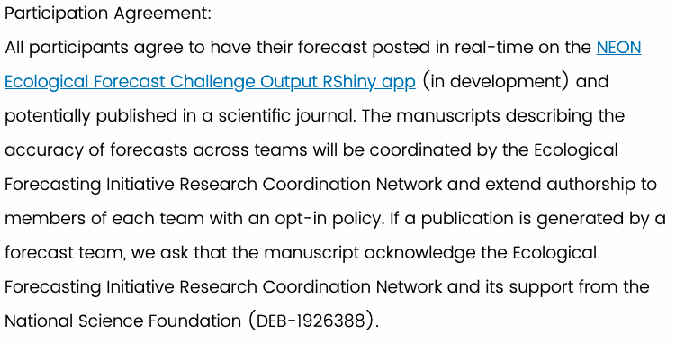
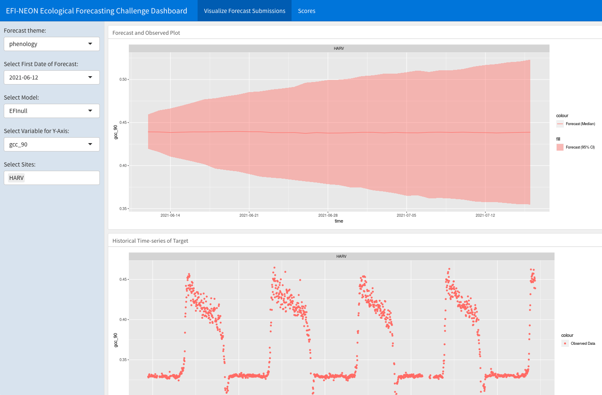

```{r include=FALSE}
library(here)         # Manage working directories

wd <- here("04_submit_forecast")
```

# Submitting to the challenge  


Anna Spiers, University of Colorado | Boulder  
EFISA Early Career Workshop  
14-15 June 2021  


# Learning objectives


<div style="text-align: left"> 
In this tutorial, you will learn how to:  

1. Register a team   
2. Generate a forecast file  
3. Generate an associated metadata file  
4. Submit your forecast and metadata files  
5. Visualize your submission  
</div>

# 1. Create team 
<div style="text-align: left"> 
* [Register](https://nd.qualtrics.com/jfe/form/SV_9MJ29y2xNrBOjqZ) as a team or  individual 
* Team registrant will be the contact person
* Up to 40 team members
* Read the *Participation Agreement* 
</div>



# 1. Create team 
* You may submit multiple models for one theme or submit forecasts to other themes, but you need to register a new team for each individual model. 
* EFI-RCN Slack and [Github](https://github.com/eco4cast) 
* Teams are allowed and encouraged to join the challenge after the start date of each Challenge theme because there are multiple deadlines to submit forecasts. 
* See [EFI's Youtube Channel](https://www.youtube.com/channel/UCZ2KQdo1-FhNRtEBYxai5Aw) for recorded Q&As
* Beetle Community Challenge Q&A is coming up in June.


# 2. Create forecast 
* [NEON EFI Challenge Overview](https://projects.ecoforecast.org/neon4cast-docs/submission-instructions.html)
* `csv` or `netCDF` file
* Teams may submit an incomplete forecast. 
* Forecasts must be submitted in a particular format in order to pass a set of internal check that allow the forecast to be visualized on the NEON Ecological Forecast Challenge dashboard and evaluated with the scoring process.
* Each theme has its own specified columns
* We have Alexey's forecast in csv format
```{r message=FALSE, warning=FALSE}
library(neon4cast)
library(dplyr)

fc_raw <- readr::read_csv(file.path(wd,"data","forecast-2021-05-15.csv"))
```


# 2. Create forecast 
* Let's check that the variable names match what is expected for the phenology challenge: 
    * `time`, `siteID`, `ensemble` or `statistic`, `forecast`, `data_assimilation`, `gcc_90`: 
```{r}
head(fc_raw)
```


# 2. Create forecast 
<div style="text-align: left"> 
* Edit forecast data.frame to have required columns
    * `time`, `siteID`, `ensemble` or `statistic`, `forecast`, `data_assimilation`, `gcc_90`: 
</div> 
```{r}
fc_raw %>% 
    mutate(siteID = "HARV",
           forecast = 1,
           data_assimilation = 0) %>%
    rename(gcc_90 = gcc_pred) %>%
    relocate(siteID, .after = time) %>%
    relocate(gcc_90, .after = data_assimilation) %>%
    head()
```


# 2. Create forecast 
* Your file name must be formatted like so:  `theme_name-year-month-day-team_name_ID.csv`
* Other theme names are listed in the Submission section of the Challenge Overview.
```{r}
forecast <- fc_raw %>% 
    mutate(siteID = "HARV",
           forecast = 1,
           data_assimilation = 0) %>%
    rename(gcc_90 = gcc_pred) %>%
    relocate(siteID, .after = time) %>%
    relocate(gcc_90, .after = data_assimilation) 

# Write the forecast to a file following EFI naming conventions:
forecast_file <- glue::glue(file.path(wd,"data","{theme}-{date}-{team}.csv"),
                            theme = "phenology",
                            date = Sys.Date(),
                            team = "wigglaspen")
readr::write_csv(forecast, forecast_file)
```


# 2. Create forecast 
<div style="text-align: left"> 
* Validate saved forecast
</div> 
```{r warning=FALSE}
forecast_output_validator(forecast_file)
```


# 2. Create forecast 
* Scores for valid forecasts will appear on the [Rshiny app](https://shiny.ecoforecast.org) the day after submission 
* Scores are only possible once the data becomes available in the corresponding targets file
```{r message=FALSE}
# Score forecast locally
scores <- score(forecast, theme = "phenology")

# Summarize by site
scores %>% 
  group_by(siteID, target) %>% 
  summarise(mean_score = mean(score, na.rm=TRUE))
```


# 3. Create metadata
* [Metadata format instructions](https://projects.ecoforecast.org/neon4cast-docs/submission-instructions.html#metadata-format) available on the Challenge Overview page
* Metadata are required with submission as an `xml` file:  `theme_name-year-month-day-team_name_ID.xml`
* The EFI-RCN has created a metadata standard built off of the widely used [Ecological Metadata Language (EML)](https://eml.ecoinformatics.org/)
* Teams are highly encouraged to publicly archive their code and workflows. 


# 3. Create metadata
* The `neon4cast` package has two helper functions to generate metdata in the correct format:
    * `create_model_metadata()` Creates a `yml` file that has the same name as your forecast file. Modify the fields in this file and save it
    * `write_model_metadata()` Writes an xml file from the forecast and yml files


# 3. Create metadata      
```{r message=FALSE, warning=FALSE}
# Generate yaml
create_model_metadata(forecast_file)


metadata_yaml <- glue::glue(file.path(wd, "data", "{theme}-{team}.yml"),
                            theme = "phenology",
                            team = "wigglaspen")
# Generate xml from yaml
write_metadata_eml(forecast_file = forecast_file,
                   metadata_yaml = metadata_yaml,
                   forecast_issue_time = Sys.Date(),
                   forecast_iteration_id = "1")
```
    

# 4. Submit! 
* [Submission process](https://projects.ecoforecast.org/neon4cast-docs/submission-instructions.html#submission-process) instructions on the Challenge Overview are not up to date. 
* You may still follow these instructions, but you are advised to use the `neon4cast::submit()` function
```{r}
metadata_xml <- glue::glue(file.path(wd, "data", "{theme}-{date}-{team}.xml"),
                            theme = "phenology", 
                            date=Sys.Date(),
                            team = "wigglaspen")

# By default, you must manually type Yes in console to confirm submission
# submit(forecast_file, metadata = metadata_xml)
```


# 5. View Results in Shiny App 
<div style="text-align: left"> 
* [EFI-RCN Shiny Evaluation App](https://shiny.ecoforecast.org/)
</div> 




# Questions? 
* Refer to the [Challenge Overview](https://projects.ecoforecast.org/neon4cast-docs/), which has  FAQs 
* If you have a question, it's likely that other teams have it too, so ask on Slack so other teams can see the discussion
* Contact `eco4cast.initiative@gmail.com` 
<div style="text-align: center"> 

</div> 

